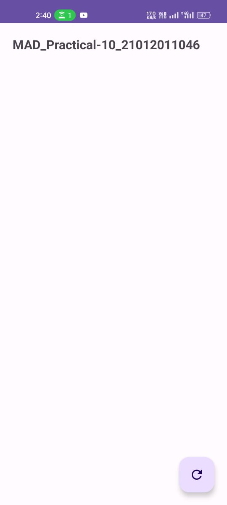
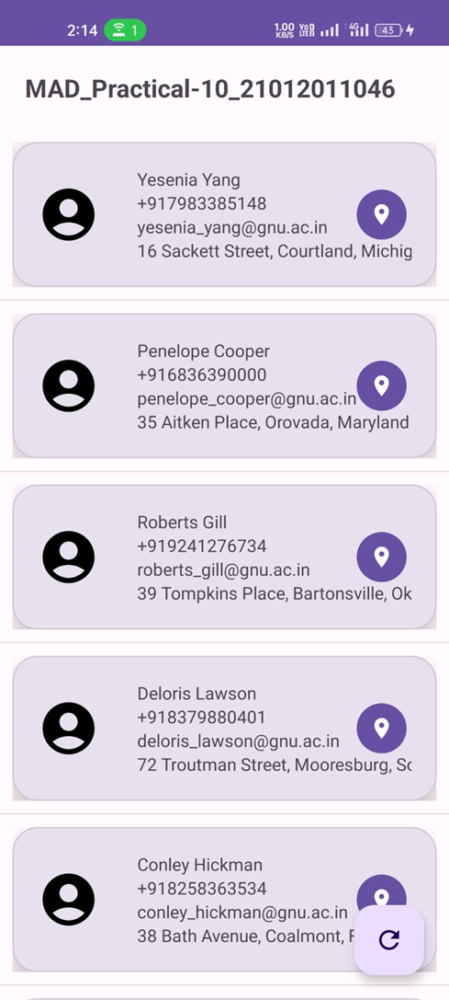
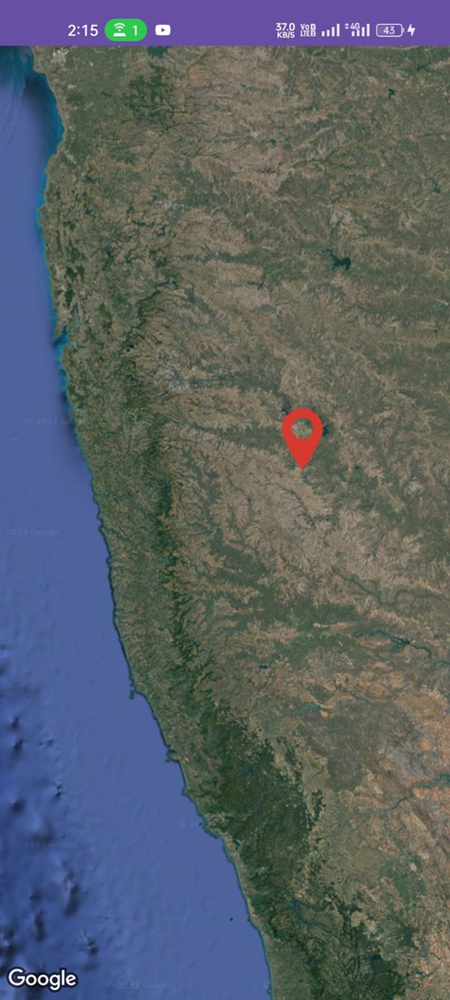

# Practical 10 -Android Application for Contact Management and Map Display

## Overview

This Android application is designed to manage contact information with JSON data and display contact details in a RecyclerView. Additionally, it includes a Google Map Activity that displays the location data received from the JSON in a Google Maps view, with a zoom level set to 10.

## Features

1. Create a `MainActivity` with a user interface that allows users to request and display contact data.
2. Use a JSON data link generated from the [JSON Generator website](https://app.json-generator.com/) to fetch contact information.
3. Implement a `MapsActivity` for displaying the location data from the JSON in a Google Maps view.
4. Define a `Person` class with member variables, including `id`, `Name`, `Phone No`, `Email Id`, `Address`, `Latitude`, and `Longitude`. This class should inherit from the `Serializable` class to allow data transfer between activities.
5. Generate JSON data in the specified format.
6. Utilize either a RecyclerView or ListView Adapter for displaying contact data.
7. Add the internet permission in the AndroidManifest.xml file to allow network requests.
8. Implement a `HttpRequest` class for communicating with web URLs.
9. Use a Google Maps API key for displaying location data on the map.

## Project Structure

The project consists of several files and components:

1. `activity_main.xml`: Layout file for the main activity.
2. `activity_maps.xml`: Layout file for the Google Maps activity.
3. `data_item.xml`: Layout file for the contact list item.
4. `Contact.kt`: Class for managing contact details, including JSON parsing.
5. `ContactAdapter.kt`: Adapter for populating contact details in a list.
6. `HttpRequest.kt`: Class for making HTTP requests to fetch JSON data.
7. `MainActivity.kt`: Main activity for fetching and displaying contact information.
8. `MapsActivity.kt`: Activity for displaying location data on Google Maps.
9. `AndroidManifest.xml`: Manifest file including permissions and activity declarations.

## Usage

1. Run the application on an Android device or emulator.
2. Click the "Refresh" button in the main activity to fetch contact data from the specified JSON link.
3. View the contact details displayed in the RecyclerView or ListView.
4. Click the location icon to view the contact's location on Google Maps.

**Note:** Before running the application, make sure to replace the Google Maps API key in the manifest file with your own key.

## Author

- Submitted By: MAKWANA SWASTIK PRAVIN
- Enrollment number: 21012011046
  
# ScreenShots

